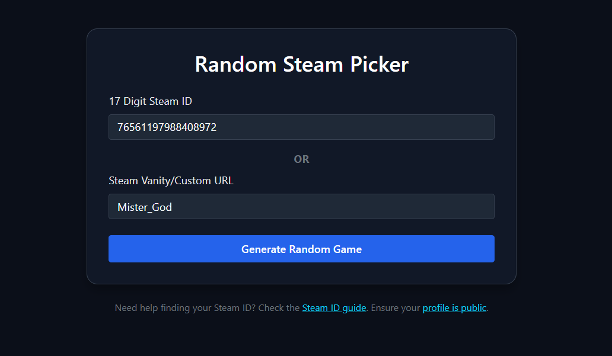
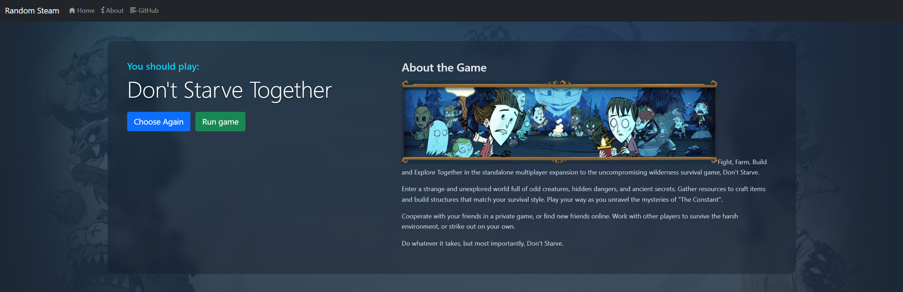

# RSG-UTILITY: Random Steam Game Picker

**Protocol ID:** RSG-RANDOMIZER-01  
**Codename:** Random Steam Game Picker  
**Status:** Operational  
**Maintainer:** Kyle Givler  

> A fast random game picker for Steam libraries.  
> Built to answer the ancient question: **“What should I play?”**

**Live instance:** [https://randomsteam.kgivler.com](https://randomsteam.kgivler.com)

---

## 1.0 System Overview

Random Steam Game Picker is a small web utility that selects a random game from a public Steam library.

It is designed for people with too many games, too little decision-making energy, and a dangerous relationship with the "Choose Again" button.

Enter a SteamID or Vanity URL, let the system query your library, and receive one game from the backlog.

---

## 2.0 Core Features

- Pick a random game from a Steam library
- Supports SteamID and Vanity URL lookup
- Fast responses using server-side caching
- Optionally block games from future picks in the browser
- Reset blocked games
- View basic game details and playtime
- Export a Steam library to CSV
- Launch directly with `steam://run/{appId}` on supported desktop systems

---

## 3.0 Architecture

The system is built around a small .NET stack:

| Layer | Purpose | Implementation |
| --- | --- | --- |
| Interface | User input and result display | Blazor Interactive Auto |
| API | Game selection, validation, Steam access | ASP.NET Core |
| Steam Integration | Library and app data retrieval | Steam Web API / Store API |
| Cache | Reduce Steam API calls and improve response time | SQLite-backed distributed cache |
| Observability | Best-effort completion telemetry | Mission Control |
| Browser State | Remember local picker preferences | Cookies |

The application favors speed over spectacle. The goal is to get a usable answer quickly, not simulate a casino wheel for eight seconds.

---

## 4.0 Runtime Flow

1. User enters a SteamID or Steam Vanity URL.
2. The server validates the request.
3. Steam library data is loaded from cache or retrieved from Steam.
4. A random eligible game is selected.
5. Game details are returned to the UI.
6. The user either plays the game, chooses again, or blocks it from future local picks.
7. Library refreshes stay on a 12-hour cooldown so cache invalidation stays intentional.

---

## 5.0 Screenshots

### Main Interface



The main screen accepts a SteamID or Vanity URL and starts the selection process.

### Selection Output



The result screen displays the selected game, playtime, description, and available actions.

---

## 6.0 Roadmap

Planned or considered modules:

- Sign in with Steam
- Permanent blocked games
- Favorites
- Game filters
- Picker history
- Saved game lists
- Shared game lists
- Games from other services
- Manual game entries
- Admin dashboard

Some features may eventually become supporter or premium features.

---

## 7.0 Known Limitations

- Steam library visibility depends on the user's Steam privacy settings.
- Browser-based blocked games are stored locally and may be lost if cookies are cleared.
- `steam://run/{appId}` is mainly useful on desktop systems with Steam installed.
- Steam API availability and response time can affect uncached requests.

---

## 8.0 Development Notes

This project is intentionally practical and cache-heavy.

The picker is built around the idea that a random game response should feel instant whenever possible. Steam API calls are cached server-side, and browser identity/preferences are kept lightweight.

Mission Control is used for best-effort completion telemetry on random-game picks. Telemetry failures are logged but never block a successful response.

Game-pick telemetry uses the existing `randomsteam.game-pick.completed` event type. The event remains schema version 1 because these changes are additive payload fields under the current Mission Control convention. The payload includes:

- `provider`
- `appId`
- `unplayedOnly`
- `durationMilliseconds`
- `cacheStatus`
- `cacheAgeSeconds`
- `eligibleGameCount`
- `librarySizeBucket`
- `timings.identifierResolutionMilliseconds`
- `timings.libraryLoadMilliseconds`
- `timings.selectionMilliseconds`
- `commitSha`
- `outcome`
- `succeeded`

Cache status is reported as one of `hit`, `miss`, `refreshed`, `stale`, `bypassed`, or `unknown`. Owned-games telemetry uses versioned `owned_v2_` cache keys because the cached value now includes metadata; the first lookup for a user after deployment may therefore be a miss. Concurrent requests for the same missing key are coalesced by HybridCache so only one Steam API load runs. Callers waiting on an already-running load report `hit`, meaning the request was served by either cached data or a coalesced in-flight load. Library size buckets are `0`, `1-24`, `25-99`, `100-249`, `250-499`, `500-999`, and `1000+`.

Telemetry intentionally excludes Steam IDs, vanity URLs, IP addresses, cookies, API keys, owned-library contents, raw Steam responses, exception messages, stack traces, full user-agent strings, and selected game names.

An application startup event is published once per process start after the host is built:

`randomsteam.application.started`

The startup payload includes environment name, optional commit SHA, optional deployment type, and framework version. It is published from the post-start host lifecycle after the app has started listening. Mission Control publish failures are logged and do not crash startup.

Current major areas of interest:

- API hardening
- cache behavior
- Blazor render mode boundaries
- user features
- future authentication/persistence

---

## 9.0 Data Protection Keys

RandomSteamGame persists ASP.NET Core Data Protection keys outside the publish directory so antiforgery tokens survive app restarts and redeployments.

By default, production keys are stored under:

`%ProgramData%\JoyfulReaper\RandomSteamGame\DataProtectionKeys`

The IIS app pool identity must have read/write/create permissions to that directory.

Do not delete this folder during deployment unless you intentionally want to invalidate existing antiforgery/auth cookies.

---

## 10.0 Deployment Observability

Deployment identity can be provided through configuration or environment variables:

```text
Application__CommitSha
Application__DeploymentType
```

Recommended Compose environment entries:

```yaml
environment:
  Application__CommitSha: ${RANDOMSTEAM_COMMIT_SHA}
  Application__DeploymentType: docker
```

Health endpoints:

- `/health/live` checks only that the process is running and can serve requests.
- `/health/ready` checks local readiness dependencies such as configuration binding, SQLite access, and writable Data Protection keys.

Readiness does not call Steam or Mission Control, so cached/local traffic can remain serviceable during upstream outages.

Recommended Docker health check:

```yaml
healthcheck:
  test:
    [
      "CMD",
      "curl",
      "--fail",
      "--silent",
      "http://127.0.0.1:5182/health/live"
    ]
```

---

## 11.0 License

Copyright © 2026 Kyle Givler

This project is licensed under the MIT License.

The author assumes no responsibility for lost time, increased backlog guilt, or the system selecting exactly the game you were secretly avoiding.
