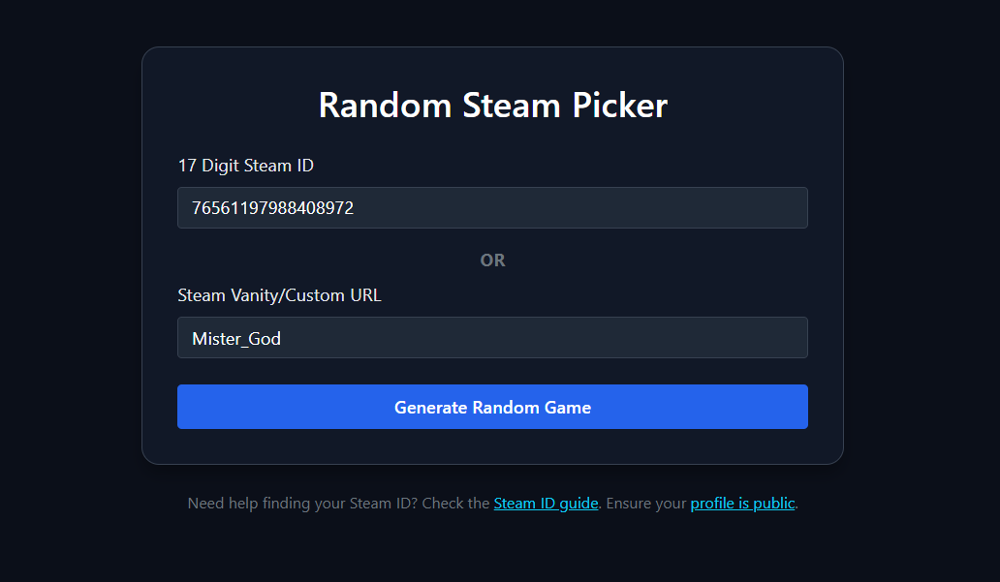
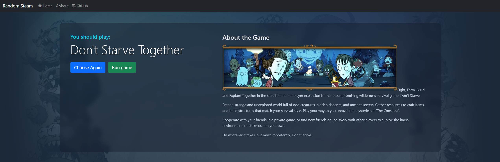

# Random Steam Game Picker

Random Steam Game Picker chooses a game from your own public Steam library. Enter a 17-digit Steam ID or Steam vanity URL, optionally limit the pool to unplayed games, and let the picker answer the important question: **What should I play?**

**Live application:** [https://randomsteam.kgivler.com](https://randomsteam.kgivler.com)

It is made for anyone with a large backlog, limited decision-making energy, and a suspicious tendency to press **Choose Again**.

## Screenshots

### Library picker



### Selected game



## Features

- Accepts a 17-digit Steam ID, vanity name, or Steam Community vanity URL
- Selects a random game the user owns from their public Steam library
- Filters the pool to games with no Steam playtime recorded when unplayed-only mode is enabled
- Supports repeated picks without returning to the home page
- Caches Steam library and Store API data to reduce upstream requests
- Blocks unwanted games from future picks in the current browser and can reset the blocked list
- Refreshes cached library data after the user's Steam library changes
- Displays the selected game's description and recorded playtime
- Opens the selected game through the Steam desktop client
- Exposes a CSV library export endpoint through the server API

Steam must be able to access the profile's game details. Picker preferences and blocked games are stored in browser cookies, so they do not synchronize across browsers or devices.

## How It Works

1. Enter a Steam ID or vanity URL.
2. The application loads the user's public Steam library.
3. It removes games that do not match the selected options or that were blocked in the current browser.
4. It randomly selects one eligible game and loads its details.
5. Play it, choose again, or block it and roll once more.

## Tech Stack

- .NET 10 and ASP.NET Core
- Blazor Web App with Interactive Auto components
- Steam Web API and Steam Store API
- ASP.NET Core HybridCache with memory and SQLite-backed caching
- SQLite for lightweight application data
- Optional Mission Control telemetry

## Repository Overview

| Project | Responsibility |
| --- | --- |
| `RandomSteamGame` | ASP.NET Core host, routed pages, controllers, middleware, persistence, and server services |
| `RandomSteamGame.Client` | Interactive picker components, browser state, and the browser-facing API client |
| `RandomSteamGame.Shared` | Contracts and abstractions shared by the host and client |
| `SteamApiClient` | Steam Web API and Store API clients plus caching |
| `RandomSteamGame.Tests` | Host, controller, provider, persistence, and component-supporting tests |
| `SteamApiClient.Tests` | Tests for the Steam integration library |

The central picker flow is `GameController` → `GameProviderFactory` → `SteamProvider` → `SteamApiClient`.

## Running Locally

### Prerequisites

- [.NET 10 SDK](https://dotnet.microsoft.com/download/dotnet/10.0)
- A [Steam Web API key](https://steamcommunity.com/dev/apikey)

### Setup

Clone the repository:

```powershell
git clone https://github.com/JoyfulReaper/RandomSteamGame.git
cd RandomSteamGame
```

Store the Steam API key with .NET user secrets. Do not put a real key in a tracked configuration file:

```powershell
dotnet user-secrets set "Steam:ApiKey" "YOUR_STEAM_WEB_API_KEY" --project RandomSteamGame/RandomSteamGame.csproj
```

Restore, build, and run the application:

```powershell
dotnet restore RandomSteamGame.slnx
dotnet build RandomSteamGame.slnx --no-restore
dotnet run --project RandomSteamGame/RandomSteamGame.csproj --no-build
```

The development profile listens at [http://localhost:5182](http://localhost:5182).

SQLite data and development Data Protection keys are created automatically. Mission Control is disabled by default and is not required for local development.

## Configuration

The only secret required for normal local use is the Steam Web API key:

| Configuration key | Environment variable | Purpose |
| --- | --- | --- |
| `Steam:ApiKey` | `Steam__ApiKey` | Reads public library data from the Steam Web API |

The tracked [`RandomSteamGame/appsettings.json`](RandomSteamGame/appsettings.json) also contains non-secret settings for caching, rate limiting, allowed origins, canonical hosts, Data Protection, and optional Mission Control telemetry.

## Tests

Run all solution tests from the repository root:

```powershell
dotnet test RandomSteamGame.slnx
```

To run an individual test project:

```powershell
dotnet test RandomSteamGame.Tests/RandomSteamGame.Tests.csproj
dotnet test SteamApiClient.Tests/SteamApiClient.Tests.csproj
```

## Contributing

Focused issues and pull requests are welcome. Describe the user-visible behavior, keep unrelated changes separate, and add or update tests when the behavior is testable.

Use [GitHub Issues](https://github.com/JoyfulReaper/RandomSteamGame/issues) for bug reports and feature proposals.

## Roadmap

Planned or considered improvements include:

- Steam sign-in and account-linked preferences
- Permanent blocked games that follow the user across devices
- Favorites and picker history
- More game filters
- Saved and shareable game lists

These are future ideas, not currently implemented features.

## Additional Documentation

- [Developer handoff](docs/developer-handoff.md) — deeper architecture, request flow, caching, deployment, and debugging notes
- [Premium feature issues](docs/premium-feature-issues.md) — account-related roadmap and likely implementation areas

## License

Random Steam Game Picker is licensed under the [MIT License](LICENSE.md).

The license does not protect you from backlog guilt or from the picker selecting exactly the game you were secretly avoiding.
